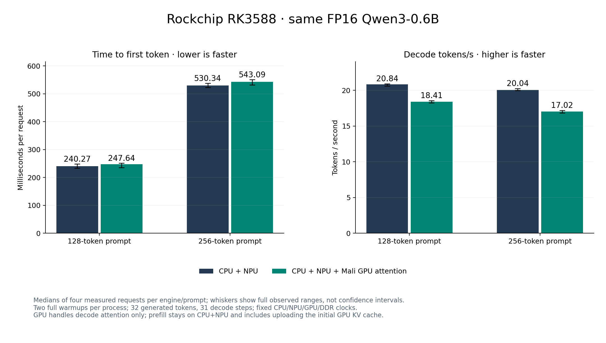
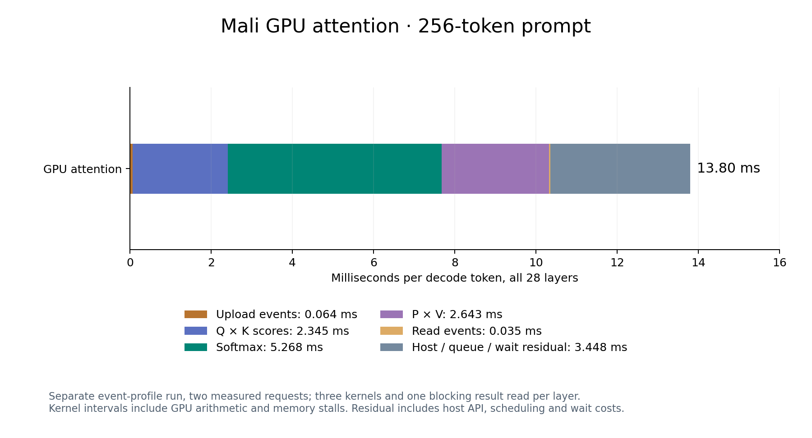

# Rockchip CPU / Mali GPU / NPU experiment

A real three-device inference runner was built and tested on this RK3588.
Dense projections continue to use the existing direct-register NPU backend;
Mali OpenCL handles attention; CPU runs normalization, RoPE, SwiGLU, residuals
and sampling. The tested GPU decode route is **11.7–15.1% slower** than the
selected CPU+NPU runner. GPU prefill fails the unchanged numerical gate.
The selected runner and its source remain unchanged.

INTENT: current prefill attention uses NPU matmuls plus CPU softmax/layout conversion and decode attention runs on CPU; the user requests a tested CPU/GPU/NPU split on Rockchip; fp16/README.md describes NPU projections with CPU non-matrix operations and attention precision.

## What was tested

| Operation | Selected CPU+NPU | Experimental CPU/GPU/NPU |
| --- | --- | --- |
| Q/K/V, WO, FFN gate/up/down, vocabulary head | Direct-register NPU | Same NPU kernels and weights |
| Norms, RoPE, SwiGLU, residuals, greedy selection | CPU | CPU |
| Prompt attention | NPU QKᵀ/P×V + CPU softmax | GPU variant implemented, but rejected by full-model quality check |
| Decode attention | CPU, FP32 Q/K/V and probabilities | Mali OpenCL, FP32 Q/K/V and probabilities |

The accepted experiment routes operations with **serial dependencies**:
NPU QKV → CPU norm/RoPE → GPU attention → NPU WO. It does not split the same
FFN matrix concurrently across CPU, GPU and NPU. Each GPU attention call uses
three kernels and one blocking output read. Persistent device KV buffers keep
the prefix and upload only the new K/V row during decode. CPU arrays retain
the ordinary cache as well. Initial prefix uploads are included in TTFT.

This is a partial GPU inference experiment, not a complete GPU model runner
or a llama.cpp GPU benchmark. OpenCL initialization records the actual
`Mali-LODX r0p0` device and dispatch counters; unavailable GPU or failed calls
abort rather than silently reverting to another device.

## Relationship to oMLX

oMLX's experimental implementation partitions independent FFN output channels
across ANE and GPU, with optional CPU branches and native merging. Its ANE
weights are requantized to INT8, so the ANE branch is approximate. Supported
prefill shapes and the profitable split depend on the machine and model.
Decode remains on its usual GPU path. See the primary
[hybrid design](https://github.com/jundot/omlx/blob/main/docs/experimental/qwen35_ane_prefill.md)
and [release notes](https://github.com/jundot/omlx/releases).

Our prototype keeps the shared FP16 checkpoint and tests operation placement
first. oMLX's concurrent FFN partitioning remains an untested follow-up on
Rockchip. Its Apple measurements do not establish a speedup for this board.

## Same-model quality checks

Both engines load the identical `Qwen/Qwen3-0.6B` FP16 container, revision
`c1899de289a04d12100db370d81485cdf75e47ca`, context 512. No integer
requantization or replacement model is used. Checkpoint SHA256:
`c92807935bfbb81f6628e9c2723267da367577a3f2b1bb2530b87bf5e5bba879`.
The effective tensors are the same as the earlier matched FP16 RKLLM test.

- Eight standalone attention cases check every output against a double
  accumulation reference at lengths 24, 73, 128 and 256. All pass the
  predefined relative RMSE limits: `1e-4` prefill and `1e-5` decode.
- GPU decode passes five full-model cases: 1, 24, 73, 128 and 256 input tokens,
  two complete warmups plus one measurement each, 16 generated tokens. All
  generated IDs match, and first-prefill logits are bit-identical because
  prefill retains the original CPU+NPU arithmetic.
- The paired performance runs also retain all 32 generated IDs, including
  warmups, and bit-identical first-prefill logits. Decode logits are not
  asserted bit-identical; agreement is checked through output tokens and
  standalone attention errors on this finite set.

### Failed GPU prefill, retained

The GPU prefill variant uses FP16 Q/K/V and probabilities with FP32
accumulation, matching operand precision rather than hardware reduction order.
On the real 24-token chat case, first-logit relative RMSE versus the selected
custom runner is **0.0025671642**, above the predeclared **0.001** limit. This
fails even though all 16 generated IDs match.

Changing softmax maximum initialization to match the original implementation
produces the same failure. Both failed binaries, source variants, dumped
logits and logs are retained in `quality-failed-1` and `quality-failed-2`.
GPU prefill is excluded from qualified performance comparisons.

A diagnostic evaluates GPU and original NPU attention on identical real layer
inputs. Layer output relative errors range up to `2.0767e-5`, much smaller
than the whole-model logit error. Amplification of reduction differences
through repeated FP16 rounding is a plausible explanation, not a proven
single cause. Synthetic correctness alone did not establish full-model parity.

## Fixed-clock, transfer-inclusive comparison

Date: 2026-10-05. Four measured requests per engine and prompt length, two
complete warmups per process, identical input IDs, empty logical KV history,
32 greedy generated tokens, 31 timed decode steps, EOS 151645 suppressed.
CPU cores 4–7 run four threads; CPU 2.256 GHz, NPU 1 GHz, GPU 1 GHz,
DDR 2.112 GHz, three NPU cores, IOMMU domain 1, `GOMP_SPINCOUNT=1000`.
128-token blocks are CPU+NPU / hybrid / hybrid / CPU+NPU; 256-token blocks
reverse that order. Hardware processes run serially. All 377 clock samples
hold; temperature is 46.230–70.230°C; previous clock settings are restored.

| Prompt | Engine | Median TTFT ms | Observed TTFT range | Median decode t/s | Observed decode range |
| --- | --- | ---: | ---: | ---: | ---: |
| 128 | CPU+NPU | **240.272** | 233.324–248.339 | **20.8355** | 20.619–20.927 |
| 128 | CPU+NPU+GPU decode attention | 247.636 | 235.705–251.220 | 18.4050 | 18.253–18.546 |
| 256 | CPU+NPU | **530.337** | 523.127–537.491 | **20.0420** | 19.963–20.264 |
| 256 | CPU+NPU+GPU decode attention | 543.091 | 531.884–550.766 | 17.0215 | 16.843–17.176 |

Decode throughput decreases **11.67% / 15.07%**; observed decode ranges do
not overlap. TTFT medians increase **3.06% / 2.40%**, including initial GPU
KV uploads; TTFT ranges overlap. Four samples are not confidence intervals.
These results compare custom device routes. The earlier independently paired
[stock RKLLM comparison](ROOFLINE.md) remains the source of stock speed claims.



Download [PNG](hybrid.png), [JPG](hybrid.jpg), or [SVG](hybrid.svg).

## GPU compute / copies / launch costs

A separate event-profile run uses the 256-token prompt, two full warmups and
two measured requests with the same clocks. All 54 samples hold, outputs
match and clocks are restored. The table is the median cost per decode token
across all 28 layers. OpenCL event profiling is enabled only in this diagnostic,
not in the paired performance comparison.

| GPU attention component | ms/token |
| --- | ---: |
| Q/K/V upload device events | 0.0645 |
| Q × K score kernel | 2.3453 |
| Softmax kernel | 5.2677 |
| Probability × V kernel | 2.6434 |
| Output read device events | 0.0350 |
| Host / queue / wait residual | 3.4481 |
| Whole GPU attention wall | **13.8039** |



Download [PNG](gpu-costs.png), [JPG](gpu-costs.jpg), or [SVG](gpu-costs.svg).

There are 84 GPU kernels and 28 blocking output reads per decode token.
Logical transfers are 458,752 uploaded bytes and 229,376 read bytes per token.
The initial 256-token KV prefix uploads 58,720,256 bytes across 28 layers:
7.845 ms wall and 4.451 ms in upload events. These are OpenCL API payloads,
not actual DRAM bus transactions.

Kernel event intervals include both arithmetic and GPU memory stalls. The
host residual is whole attention wall minus in-order device event intervals;
it includes API work, scheduling, waits and instrumentation. The blocking-read
API span is 13.176 ms/token because it waits for preceding kernels and copies;
it must not be called pure download time or added to those intervals.
Component medians are not generally additive; the two-request medians here
are additive because each is the average of those two observations.

The [complete CPU/NPU profile](PROFILE.md) measured CPU decode attention at
about 4.461 ms/token for this prompt, versus 13.804 ms in this GPU prototype.
Those are separate diagnostic runs, not a synchronized subtraction of the
paired engine times. GPU softmax's small dispatch and repeated launches/waits
are concrete targets. Transfer event durations alone do not explain the loss.

## What to optimize next

1. **Retain CPU decode attention for these short contexts.** Improve CPU
   attention and selection independently, then measure the crossover with
   longer sequences before choosing GPU automatically. Contexts above 512
   were not tested here.
2. **Prefill host layout and shared GQA KV packing.** The complete profile
   attributes 171.361 ms/request to packing/copies/layout after 256 input
   tokens. Reusing KV packs and reducing output conversion are candidates
   supported by the measured costs.
3. **Fuse GPU attention and parallelize softmax.** Current score, softmax and
   value kernels launch separately; each softmax work item serially walks
   its head's sequence. A fused implementation could reduce dispatches and
   materialized intermediates. Savings remain unmeasured.
4. **Shared DMA storage and concurrent FFN slices.** Mali advertises ARM
   host/DMA import extensions, but cross-NPU/GPU buffer import and coherency
   have not been validated. A real oMLX-like FFN split needs independent
   output slices, safe joining, transfer accounting and the same quality gate.
   The devices share DDR; extra devices do not supply extra memory bandwidth.

These are follow-ups from the measurements, not claimed performance gains.
No speculative register flags or changed precision were promoted.

## Sources, raw data and reproduction

Workspace:
[/home/orangepi/qwen3-bench/matched/roofline/hybrid](/home/orangepi/qwen3-bench/matched/roofline/hybrid).

- [OpenCL attention kernels](/home/orangepi/qwen3-bench/matched/roofline/hybrid/attention.cl)
  and [GPU buffer/event implementation](/home/orangepi/qwen3-bench/matched/roofline/hybrid/gpu_attention.c).
- [Isolated build](/home/orangepi/qwen3-bench/matched/roofline/hybrid/build_hybrid.py),
  [source hashes](/home/orangepi/qwen3-bench/matched/roofline/hybrid/source-provenance.json),
  [runner](/home/orangepi/qwen3-bench/matched/roofline/hybrid/runq-hybrid).
- [Independent audit and results](/home/orangepi/qwen3-bench/matched/roofline/hybrid/hybrid-report.json),
  [quality runs](/home/orangepi/qwen3-bench/matched/roofline/hybrid/quality/summary.json),
  [paired runs](/home/orangepi/qwen3-bench/matched/roofline/hybrid/performance/summary.json),
  [GPU event runs](/home/orangepi/qwen3-bench/matched/roofline/hybrid/profile/summary.json).
- [First failed prefill](/home/orangepi/qwen3-bench/matched/roofline/hybrid/quality-failed-1/failure.json),
  [second failed prefill](/home/orangepi/qwen3-bench/matched/roofline/hybrid/quality-failed-2/failure.json).
- [Plot source](/home/orangepi/qwen3-bench/matched/roofline/hybrid/plot_hybrid.py),
  [plot/data provenance](hybrid-plot-provenance.json). Raw per-request files,
  exact inputs, environment and per-suite harness snapshots sit beside the summaries.

```bash
cd /home/orangepi/qwen3-bench/matched/roofline/hybrid
# Read-only audit of the saved original suites; run with board clocks restored.
OPENBLAS_NUM_THREADS=1 python3 audit_hybrid.py
# Sequential hardware rerun, using a new directory to retain original evidence.
OPENBLAS_NUM_THREADS=1 python3 run_hybrid.py performance --output performance-repeat
```

The harness uses the existing privileged clock helper and restores CPU/NPU/GPU/DDR
settings in `finally`. Existing result directories are refused. The audit
checks the saved original suites, not arbitrary repeats.

Selected executable SHA256:
`100716de3aca7c4efc7a5b0a5a87178c41adc3bc4049a5f1c009a83fe051ff58`.
Hybrid executable SHA256:
`97e47f0aa091ede123c12c08e15cfe95e4e33cccac2646f5557539230c28341e`.
Source, NPU backend, shared model hash, device dispatches, all tested tokens,
recorded clocks and live restored settings pass the independent audit.
