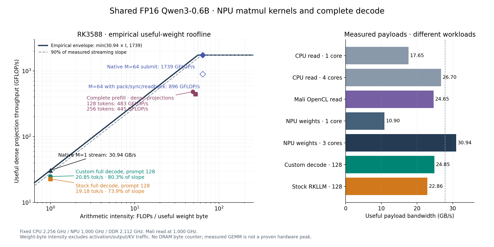
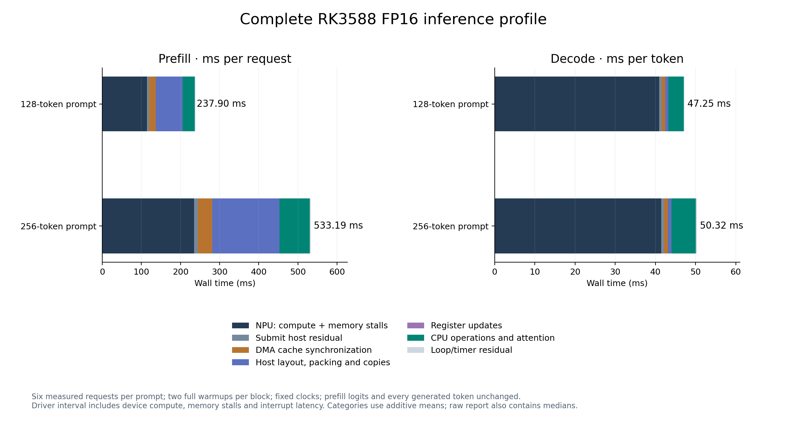

# Complete CPU/NPU phase profile

The tested `runq-fp16` uses **qwen3.c as the host transformer scheduler with
custom NPU matrix kernels generated through register commands**. Full inference
is split between the CPU and NPU. There is no RKLLM runtime in this runner.
The ordinary `runq` executable is the older Q8 path; these results use `runq-fp16`.

| Work | Device / mechanism |
| --- | --- |
| Q/K/V, output projection, gate/up/down FFN, vocabulary head | NPU; persistent native FP16 weights, direct register command buffers and blocking RKNPU submissions |
| Prefill QKᵀ and probability × V | NPU; FP16 operands, FP32 accumulation/output |
| RMSNorm, Q/K norm, RoPE, causal masking, softmax, SwiGLU, residual adds | CPU |
| Decode attention, KV layout/cache updates, packing, output handling, greedy selection | CPU |

The scheduler is in [prefill.h](prefill.h); [fp16_backend.c](fp16_backend.c)
prepares native commands and submits them through `DRM_IOCTL_RKNPU_SUBMIT`.
[attention_backend.h](attention_backend.h) schedules prefill attention.
This architecture has already retained balanced classifier tiles and a
three-core FFN down bundle; see [ROOFLINE.md](ROOFLINE.md).

A tested [CPU / Mali GPU / NPU route](HYBRID.md) now includes matched engine
timings and OpenCL upload/kernel/read event costs. GPU decode regresses in
this prototype; GPU prefill fails its unchanged numerical gate.

## Rendered roofline and timing chart



Download the roofline as [PNG](roofline.png), [JPG](roofline.jpg) or [SVG](roofline.svg).
The curve uses the measured **30.94095 GB/s** useful NPU weight stream and
best observed **1739.44236 GFLOP/s** native FP16 GEMM. Its full-model points
come from the saved fair custom/stock comparison, with the same FP16 checkpoint.
Complete decode reaches **80.3%** of that streaming slope after 128 input tokens.
This is an empirical useful-weight envelope, not measured DRAM bus utilization
or a proven maximum compute ceiling.

Prefill intensity counts logical matrix weights for each actual row chunk:
M≤64 for QKV/streamed FFN, M≤32 for WO, and one vocabulary projection.
After 128 tokens this is 2,307,653,632 logical weight bytes and
113,054,056,448 dense FLOPs. After 256 tokens it is 4,304,142,336 bytes and
225,796,947,968 dense FLOPs. Activation, output and KV traffic are excluded.
The plotted dense throughput divides these FLOPs by whole-request TTFT.



Download phase costs as [PNG](profile.png), [JPG](profile.jpg) or [SVG](profile.svg).
The chart uses additive averages; the tables below use component medians.

## Complete profiling measurements

Date: 2026-10-05. A separate instrumented copy measures full parallel-region
wall time, including streamed FFN prefill, attention, register updates, native
FP16 packing, input copies, output copies/transposes/reduction, DMA cache
synchronization and blocking NPU calls. Driver-returned timing is recorded
inside the blocking call. Counters are updated outside worker loops; profile
printing occurs after each timed phase. The selected source and executable
are unchanged.

INTENT: the earlier profiler omits streamed FFN and combines packing/copies while the CPU schedules inference; the task expects rendered empirical roofline and complete compute/memory/communication timing; fp16/README.md describes NPU projections and prompt attention with CPU norms, RoPE, softmax, SwiGLU and decode attention.

Both prompt lengths use six measured requests per binary, two complete
warmups per process, identical input IDs, empty logical KV history, 32 greedy
output tokens with EOS suppressed, 31 timed decode steps, context 512, three
NPU cores, domain 1, four CPU threads on cores 4–7 and `GOMP_SPINCOUNT=1000`.
CPU is fixed at 2.256 GHz, NPU at 1 GHz and DDR at 2.112 GHz. Jobs are serial.
128-token blocks use reference/profile/profile/reference; 256-token blocks
use profile/reference/reference/profile. Temperatures range 43.461–72.076°C;
all 408 clock samples hold, and the original settings are restored and read back.

| Component, median | Prefill 128 ms/request | Decode after 128 ms/token | Prefill 256 ms/request | Decode after 256 ms/token |
| --- | ---: | ---: | ---: | ---: |
| NPU driver launch-to-completion interval | 113.855 | 40.698 | 234.534 | 41.539 |
| Blocking submit wall minus driver interval | 4.673 | 0.597 | 10.121 | 0.652 |
| DMA cache synchronization | 17.613 | 0.940 | 36.936 | 0.973 |
| Native packing, copies and output layout/reduction | 68.445 | 0.777 | 171.361 | 0.819 |
| CPU operations, including decode attention | 30.982 | 3.796 | 77.896 | 6.174 |
| Register buffer updates | 0.206 | 0.006 | 0.211 | 0.006 |
| Loop/dispatch/timer residual | 1.321 | 0.211 | 2.334 | 0.222 |
| Whole phase wall time | **237.121** | **47.061** | **533.284** | **50.404** |

Component medians do not add exactly. Additive means, individual request
counters, bytes, root operations and per-projection details are preserved in
the raw report. Root operation spans cover **99.9666–99.9922%** of wall time.
The low-level categories are exclusive, except the driver interval nested
inside submission wall time; high-level root spans contain those details
and must not be added to them. Packing includes conversion and movement;
fused SwiGLU/packing remains one combined CPU category.

There are **959 / 1911 submissions** for prefill at 128 / 256 tokens, and
**119 per decode token**. Every warmup and measured request has the expected
counts. All returned driver timings are positive and within their blocking
wall interval. First-prefill logits dumped by each process are bit-identical
to the preserved goldens; every generated token, including all warmups,
matches the reference. No dense projection uses a CPU fallback.

| Profiling overhead check | Reference TTFT ms | Profile TTFT ms | Reference decode t/s | Profile decode t/s |
| --- | ---: | ---: | ---: | ---: |
| 128 tokens | 235.870 | 237.122 | 21.2425 | 21.2490 |
| 256 tokens | 525.386 | 533.284 | 19.8780 | 19.8400 |

Median overhead is +0.53% / +1.50% for prefill and −0.03% / +0.19% in decode
wall time. Run ranges overlap. These diagnostic runs characterize costs;
the earlier paired stock comparison remains the source of stock speed claims.

## What the driver can and cannot measure

The driver code timestamps `hw_commit_time` with `ktime_get()` immediately
before commitment, then returns `ktime_sub(now, hw_commit_time)` on completion.
The ABI value `hw_elapse_time` is **nanoseconds**, as confirmed against all
recorded wall intervals. It includes accelerator arithmetic, hardware memory
stalls and interrupt latency. The wall-minus-driver residual includes driver
setup/wait/wakeup, syscall handling and instrumentation; it is an estimate
of host submission cost rather than a dedicated communication counter.

The inspected local driver checkout is revision
`6269b0c8c3ec98655e9c2af11d1275df6771b22a`; snapshots are retained. It explains
the ABI semantics but is not asserted to be the exact loaded module build.
The active module reports version **0.9.8**. Read-only probes for data writes,
data reads, weight reads and total transfers return success while leaving a
`0xdeadbeef` sentinel unchanged. RK3588's driver configuration has
`amount_top = NULL` and `amount_core = NULL`; these getters are unsupported.
No clear/reset action or speculative MMIO access was used for this probe.

Therefore the profile separates **host compute/layout/copies/cache sync and
submission costs**. It does not separate pure NPU arithmetic time from NPU
memory stalls. Those overlap in hardware and need validated hardware stall
or traffic counters for a finer decomposition. Logical copy and synchronized
byte counts are recorded, but they are not actual DRAM transactions.

## Optimization targets and tested candidates

1. **Prefill layout costs:** output handling alone takes 35.725 / 84.929 ms
   at 128 / 256 tokens. QKV output conversion is 12.330 / 26.682 ms; attention
   scores and values contribute another 14.072 / 39.677 ms. Native packing is
   16.436 / 47.745 ms. This is the largest host-side opportunity.
2. **Prefill attention:** the full attention stage takes 81.191 / 221.760 ms.
   CPU masking/scaling/softmax takes 12.440 / 40.573 ms, and packing changing
   KV weights takes 8.547 / 22.017 ms. GQA heads currently repack shared KV
   matrices for each query head. Reusing those packs and improving vector
   layout/softmax kernels are concrete next candidates; savings are not yet measured.
3. **Decode attention and selection:** attention takes 2.376 / 4.461 ms per
   token; greedy selection takes 0.626 / 0.629 ms. Initial decode KV layout
   conversion adds an amortized 0.204 / 0.456 ms/token over the 31 steps.
4. **Device matrix shapes:** decode WO submits take 4.580 ms after 128 tokens,
   equivalent to about 25.64 GB/s of useful weights; down takes 6.381 ms,
   about 27.61 GB/s. The vocabulary head is already near the measured stream
   rate. Shape/layout experiments should target WO/down and preserve checked
   reductions. Host register rewriting is too small to explain the gap.

Two bounded changes were built independently and together from the immutable,
uninstrumented source copy. Registers, submit metadata, precision and cache
synchronization requests remain identical:

- **Direct attention output read:** read the already synchronized cacheable
  DMA map without copying into `native_output` before transposing. This is
  correct but **regresses prefill**, so it was rejected.
- **NEON greedy selection:** vectorize finite exponent checks and earliest
  maximum-index tracking. EOS is still checked for finiteness and suppressed
  only during selection. **1050 exact selection cases** cover ties, EOS and
  lengths/tails; **24 cases** verify NaN/±Inf rejection, including EOS. Every
  full-model candidate retains the same prefill logits and 32 token IDs.

| Candidate, four measurements each | 128 TTFT ms | 128 decode t/s | 256 TTFT ms | 256 decode t/s |
| --- | ---: | ---: | ---: | ---: |
| Reference | 235.980 | 20.9640 | 509.851 | 19.9370 |
| Direct read | 244.695 | 21.0110 | 540.906 | 19.8390 |
| NEON selection | 240.396 | 21.0910 | 515.614 | 20.3515 |
| Both | 239.280 | 21.2945 | 541.076 | 20.0690 |

Counterbalanced serial blocks use two complete warmups and the same clocks,
inputs and settings. All 692 clock samples hold; settings are restored.
Direct read regresses prefill by 3.6–5.7%; combining it with NEON also
regresses prefill. NEON alone improves decode medians by **0.6% / 2.1%** but
prefill medians regress by 1.8% / 1.1%. The 128-token decode ranges overlap.
It remains an experimental candidate, with no replacement of the selected
reference or new stock superiority claim. All results, including regressions,
are retained.

## Reproduction and artifacts

The selected executable SHA256 remains
`100716de3aca7c4efc7a5b0a5a87178c41adc3bc4049a5f1c009a83fe051ff58`.
The complete profiler executable SHA256 is
`b60870da8e56512487d2fab73ac3ff468147983ffa7687b74ec7be04cfb8c7f9`.

Local evidence:

- [Complete profile report](/home/orangepi/qwen3-bench/matched/roofline/full-profile/profile-report.json)
- [Profiler source generator](/home/orangepi/qwen3-bench/matched/roofline/full-profile/instrument.py),
  [serial measurement harness](/home/orangepi/qwen3-bench/matched/roofline/full-profile/run_profiles.py)
  and [independent audit](/home/orangepi/qwen3-bench/matched/roofline/full-profile/analyze_profiles.py)
- [Driver read-only probe](/home/orangepi/qwen3-bench/matched/roofline/full-profile/driver-probe.jsonl)
- [Candidate audit and complete results](/home/orangepi/qwen3-bench/matched/roofline/full-profile/candidate-report.json),
  [candidate source generator](/home/orangepi/qwen3-bench/matched/roofline/full-profile/test_candidates.py)
- [Roofline plotting source](/home/orangepi/qwen3-bench/matched/roofline/plot_roofline.py) and
  [plot provenance](/home/orangepi/qwen3-bench/matched/roofline/plot-provenance.json)
- [Cost plotting source](/home/orangepi/qwen3-bench/matched/roofline/full-profile/plot_profile.py) and
  [plot provenance](/home/orangepi/qwen3-bench/matched/roofline/full-profile/profile-plot-provenance.json)

```bash
cd /home/orangepi/qwen3-bench/matched/roofline/full-profile
python3 analyze_profiles.py
python3 audit_candidates.py
PYTHONPATH=../.plot-packages python3 plot_profile.py
cd ..
PYTHONPATH=.plot-packages python3 plot_roofline.py
```

Matplotlib 3.10.8, NumPy 2.2.6 and Pillow 12.3.0 are isolated in
`matched/roofline/.plot-packages`, used only by plotting subprocesses. Model
benchmarks and installed RKNN/tinygrad dependencies were not changed.
Scientific figures were rendered and visually inspected; the failed partial
plotting venv was removed. Raw timing logs, source/binary snapshots and failed
optimization candidates are intentional retained evidence.
