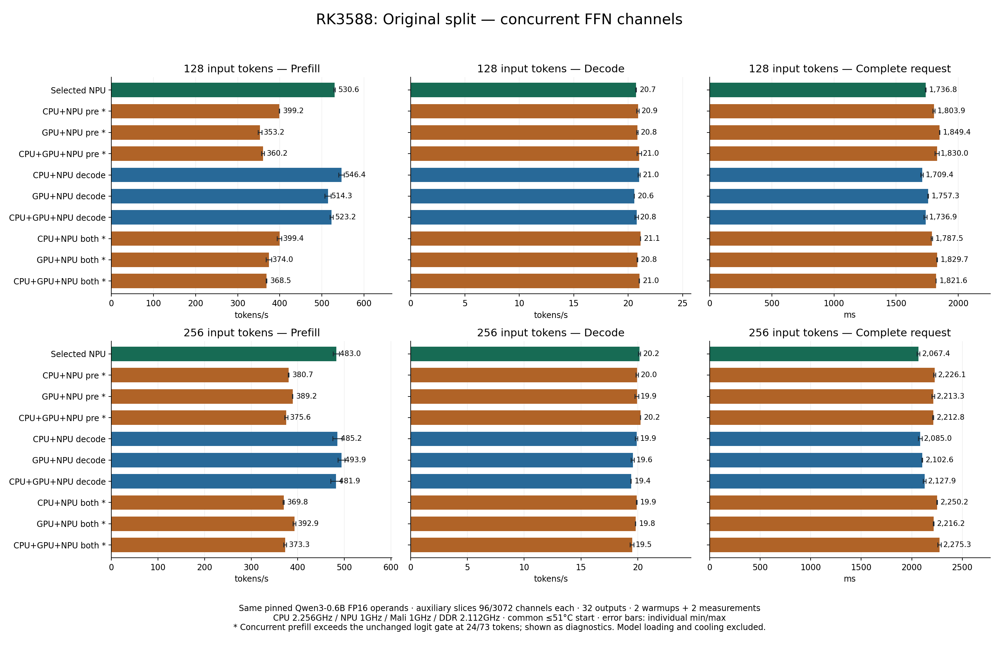
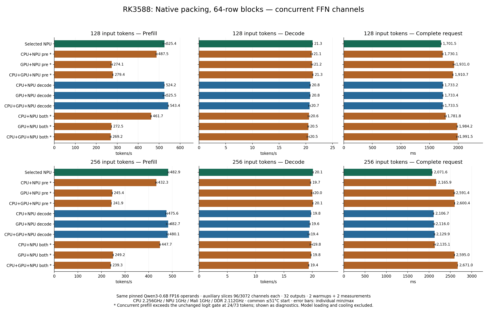

# Concurrent FFN: phase and complete-request results

The selected CPU-host/NPU-matrix engine is retained. Concurrent CPU/Mali/NPU FFN slices are implemented and checked, but these measured placements do not establish a reliable complete-request gain.

## Measurement scope

All rows use the pinned Qwen3-0.6B FP16 operands, 32 outputs (31 decode steps), two full warmups and two measurements. CPU/NPU/Mali/DDR clocks are 2.256/1.000/1.000/2.112 GHz, sampled and restored. Each request starts at <=51°C. Prefill throughput is input tokens / TTFT, including the first classifier and sampling. Request time is independently captured from prefill start through the last argmax and includes movement, DMA synchronization, queue waits and handoffs. Model loading, input-ID file reading, tokenization, warmups and cooldown are excluded.

The forty-row sweep screens placements. The original layout ran before the native layout; this order is not a counterbalanced layout comparison. Every long-prompt row passes its quality/device/clock audits. Prefill and both-phase split rows remain **diagnostics** because the separate 24/73-token checks fail the unchanged first-logit gate (six failures per layout). Passing predictions at 128/256 tokens does not resolve those failures.

Device labels describe auxiliary **FFN gate/up slices**. QKV, output, down and vocabulary projections stay on NPU; other transformer work stays on CPU. These are not whole-model GPU or NPU-resident graph claims.

[Independent forty-job audit](concurrent-request40-audit.json) · [written execution plan](concurrent-request-plan.json) · [architecture, precision and branch costs](CONCURRENT.md)

## CPU-only and Mali OpenCL baselines

These baseline rows come from the earlier independently audited placement sweep, with the same pinned FP16 checkpoint, input IDs, clocks, <=51°C start limit, 32 outputs and two warmups/two measurements. They are a separate measurement session from the concurrent FFN sweep and from the four-measurement ABBA check. Keep those sessions distinct when interpreting small differences. No new hardware run was performed for this table update.

CPU-only executes projections and attention on CPU, with no NPU/GPU execution. The GPU route executes projections and attention using custom Mali OpenCL kernels; norms, RoPE, embedding, SwiGLU, residuals and sampling remain on CPU. The NPU route uses native NPU matrices with CPU host work and decode attention.

| Input tokens | Projection / attention placement | Prefill ms | Prefill tokens/s | Decode tokens/s | Request ms |
|---|---|---:|---:|---:|---:|
| 128 | CPU only | 2016.056 | 63.49 | 18.613 | 3681.672 |
| 128 | Mali OpenCL + CPU host | 2437.915 | 52.50 | 13.171 | 4791.720 |
| 128 | NPU matrices + CPU host | 241.270 | 530.52 | 20.795 | 1732.328 |
| 256 | CPU only | 4755.320 | 53.83 | 17.896 | 6487.559 |
| 256 | Mali OpenCL + CPU host | 4965.540 | 51.56 | 12.048 | 7538.773 |
| 256 | NPU matrices + CPU host | 522.849 | 489.63 | 20.166 | 2060.198 |

The [complete placement tables](REQUESTS.md) include all nine CPU/GPU/NPU prefill-to-decode projection pairs, including CPU→GPU, GPU→CPU, GPU→NPU and NPU→GPU, plus the explicit three-device placement. The concurrent tables below include CPU+NPU, GPU+NPU and CPU+GPU+NPU FFN slices independently during prefill, decode and both phases. Phase routing and concurrent channel partitioning are different experiments.

[Baseline numerical/device/clock audit](request-matrix51-audit.json) · [placement definitions](PHASES.md)

## Original full-prompt split

[PNG](concurrent-original-requests.png) · [JPG](concurrent-original-requests.jpg) · [SVG](concurrent-original-requests.svg)

| Input tokens | FFN placement | Prefill ms | Prefill tokens/s | Decode tokens/s | Request ms | Request min–max ms |
|---|---|---:|---:|---:|---:|---|
| 128 | Selected NPU path | 241.245 | 530.58 | 20.729 | 1736.810 | 1734.087–1739.534 |
| 128 | CPU+NPU prefill* | 320.665 | 399.17 | 20.902 | 1803.877 | 1795.839–1811.915 |
| 128 | GPU+NPU prefill* | 362.355 | 353.25 | 20.848 | 1849.384 | 1848.217–1850.551 |
| 128 | CPU+GPU+NPU prefill* | 355.309 | 360.25 | 21.024 | 1829.963 | 1812.589–1847.337 |
| 128 | CPU+NPU decode | 234.248 | 546.43 | 21.017 | 1709.377 | 1699.661–1719.093 |
| 128 | GPU+NPU decode | 248.879 | 514.31 | 20.552 | 1757.297 | 1753.908–1760.686 |
| 128 | CPU+GPU+NPU decode | 244.636 | 523.23 | 20.776 | 1736.914 | 1723.591–1750.237 |
| 128 | CPU+NPU both* | 320.514 | 399.36 | 21.133 | 1787.473 | 1782.338–1792.609 |
| 128 | GPU+NPU both* | 342.214 | 374.03 | 20.841 | 1829.681 | 1825.786–1833.576 |
| 128 | CPU+GPU+NPU both* | 347.386 | 368.47 | 21.029 | 1821.621 | 1820.806–1822.437 |
| 256 | Selected NPU path | 530.050 | 482.97 | 20.166 | 2067.363 | 2053.573–2081.153 |
| 256 | CPU+NPU prefill* | 672.524 | 380.66 | 19.956 | 2226.074 | 2216.201–2235.947 |
| 256 | GPU+NPU prefill* | 657.731 | 389.22 | 19.931 | 2213.306 | 2200.226–2226.385 |
| 256 | CPU+GPU+NPU prefill* | 681.517 | 375.63 | 20.245 | 2212.796 | 2207.323–2218.268 |
| 256 | CPU+NPU decode | 527.619 | 485.20 | 19.907 | 2085.023 | 2065.850–2104.196 |
| 256 | GPU+NPU decode | 518.344 | 493.88 | 19.569 | 2102.605 | 2098.944–2106.266 |
| 256 | CPU+GPU+NPU decode | 531.276 | 481.86 | 19.417 | 2127.855 | 2113.780–2141.931 |
| 256 | CPU+NPU both* | 692.321 | 369.77 | 19.900 | 2250.159 | 2245.949–2254.368 |
| 256 | GPU+NPU both* | 651.630 | 392.86 | 19.815 | 2216.177 | 2213.068–2219.286 |
| 256 | CPU+GPU+NPU both* | 685.808 | 373.28 | 19.505 | 2275.255 | 2256.833–2293.677 |

* Prefill precision gate failures on separate short prompts; diagnostic placements.

## Native packing with 64-row blocks

[PNG](concurrent-native-requests.png) · [JPG](concurrent-native-requests.jpg) · [SVG](concurrent-native-requests.svg)

| Input tokens | FFN placement | Prefill ms | Prefill tokens/s | Decode tokens/s | Request ms | Request min–max ms |
|---|---|---:|---:|---:|---:|---|
| 128 | Selected NPU path | 243.639 | 525.37 | 21.265 | 1701.451 | 1697.303–1705.600 |
| 128 | CPU+NPU prefill* | 262.539 | 487.55 | 21.125 | 1730.130 | 1720.812–1739.447 |
| 128 | GPU+NPU prefill* | 467.007 | 274.09 | 21.177 | 1930.989 | 1913.564–1948.414 |
| 128 | CPU+GPU+NPU prefill* | 458.048 | 279.45 | 21.341 | 1910.651 | 1907.968–1913.334 |
| 128 | CPU+NPU decode | 244.181 | 524.20 | 20.820 | 1733.158 | 1727.272–1739.045 |
| 128 | GPU+NPU decode | 243.590 | 525.47 | 20.809 | 1733.402 | 1728.584–1738.219 |
| 128 | CPU+GPU+NPU decode | 235.555 | 543.40 | 20.698 | 1733.450 | 1719.698–1747.203 |
| 128 | CPU+NPU both* | 277.216 | 461.73 | 20.606 | 1781.772 | 1768.296–1795.249 |
| 128 | GPU+NPU both* | 469.750 | 272.49 | 20.471 | 1984.225 | 1976.383–1992.066 |
| 128 | CPU+GPU+NPU both* | 475.554 | 269.16 | 20.453 | 1991.491 | 1970.421–2012.561 |
| 256 | Selected NPU path | 530.105 | 482.92 | 20.111 | 2071.594 | 2069.126–2074.063 |
| 256 | CPU+NPU prefill* | 592.213 | 432.28 | 19.700 | 2165.867 | 2165.627–2166.107 |
| 256 | GPU+NPU prefill* | 1043.386 | 245.36 | 20.027 | 2591.419 | 2579.517–2603.322 |
| 256 | CPU+GPU+NPU prefill* | 1058.464 | 241.86 | 20.105 | 2600.394 | 2597.437–2603.350 |
| 256 | CPU+NPU decode | 538.309 | 475.56 | 19.765 | 2106.750 | 2100.303–2113.196 |
| 256 | GPU+NPU decode | 530.364 | 482.69 | 19.552 | 2115.994 | 2097.937–2134.052 |
| 256 | CPU+GPU+NPU decode | 533.186 | 480.13 | 19.416 | 2129.919 | 2120.001–2139.837 |
| 256 | CPU+NPU both* | 571.875 | 447.65 | 19.835 | 2135.063 | 2113.114–2157.012 |
| 256 | GPU+NPU both* | 1027.394 | 249.17 | 19.776 | 2594.992 | 2589.062–2600.921 |
| 256 | CPU+GPU+NPU both* | 1069.774 | 239.30 | 19.361 | 2670.953 | 2670.206–2671.699 |

* Prefill precision gate failures on separate short prompts; diagnostic placements.

## CPU+NPU decode: counterbalanced check

The original 128-token screen appeared to improve decode slightly. A same-binary ABBA check isolates the `FFN_MODE=2`, 96-channel CPU slice from the selected NPU path. There are four individual measured requests per route and prompt. All eight jobs pass source/model/binary, quality, actual placement, fixed clocks and restoration audits. The following medians are recomputed from all four raw measurements, not from block medians.

| Input tokens | FFN decode route | Prefill ms | Prefill tokens/s | Decode tokens/s | Request ms | Request min–max ms |
|---|---|---:|---:|---:|---:|---|
| 128 | Selected NPU path | 233.398 | 548.42 | 21.233 | 1698.990 | 1684.272–1707.796 |
| 128 | CPU+NPU decode | 240.659 | 531.87 | 20.806 | 1732.078 | 1696.762–1768.640 |
| 256 | Selected NPU path | 519.058 | 493.20 | 20.239 | 2054.194 | 2042.434–2064.682 |
| 256 | CPU+NPU decode | 523.238 | 489.26 | 19.936 | 2078.431 | 2046.476–2115.385 |

CPU+NPU decode throughput changes by -2.01% / -1.49% for 128/256 tokens; complete-request throughput changes by -1.91% / -1.17%. All observed prefill, decode and request ranges overlap. Four observations are not confidence intervals. The screen gain is not reproduced and this split is not promoted.

[ABBA raw aggregation](concurrent-cpu-decode-abba-report.json) · [independent audit](concurrent-cpu-decode-abba-audit.json) · [execution plan](iteration-concurrent-cpu-decode-e2e51-abba-plan.json)

## Physical overlap diagnostic

An initial OpenCL RUNNING-status probe did not establish overlap. A separate diagnostic then brackets GPU marker END events with host monotonic timestamps before enqueue and after wait, intersects the before/after clock-offset bounds, and widens each endpoint by 10 microseconds. Raw GPU kernel START/END, CPU worker START/END and blocking NPU submit START/END timestamps are retained for all 336 FFN blocks.

The independent timestamp auditor reproduces **84/112 blocks with simultaneous CPU worker, GPU kernel event interval and NPU blocking-submit interval** in each of two warmups and the measured request. All 112 clock maps per request are valid; the largest offset interval is 0.042166 ms. It checks conservative interval containment, rather than summing overlapping branch times. The NPU submit span includes driver work and memory stalls, so it does not isolate MAC activity. GPU kernel event spans likewise identify command execution intervals.

Marker waits and timestamp instrumentation change scheduling. This establishes concurrent execution in the diagnostic; it does not establish the same overlap fraction or any throughput gain in the unprofiled forty-row sweep. No diagnostic timing is used in those throughput tables.

[Independent raw trace audit](concurrent-overlap-trace-audit.json) · [quality/device/clock audit of all three probes](concurrent-overlap-device-clock-audit.json) · [raw traced request log](evidence/concurrent-traced-proof-51/p256-1-all_both.jsonl) · [trace auditor](concurrent-tools/audit_overlap_traces.py) · [frozen diagnostic source](concurrent-traced-proof/concurrent_ffn.c)

## Measured changes and next targets

Native packing removes almost all full gate/up assembly cost in the CPU+NPU profile (24.897 ms to 0.014 ms), but exposes CPU-worker wait and activation packing. Its CPU split remains slower than the selected NPU reference. On Mali, changing the auxiliary job shape to 64 rows raises profiled GPU kernel time from 96.639 ms to 534.538 ms and join wait from 20.981 ms to 491.723 ms. Saved assembly does not compensate. These branch profiles precede the complete-request measurements; profile timings are event-enabled diagnostics.

The selected profile identifies CPU decode attention (4.406 ms/token) and prefill activation movement/layout/SwiGLU as useful next targets. Earlier NPU attention batch128 improves prefill in a paired test but has overlapping complete-request ranges. Earlier fused GPU decode attention loses complete-request throughput. A fully GPU-resident transformer or larger tuned FFN partitions require further implementation and quality checks; the present custom Mali kernels are not an optimal llama.cpp GPU baseline.

## Reproducibility and evidence

Original and native source exports reproduce their exact tested binary hashes: `a2480d20...` and `2922f251...`. The traced observer is `d3544011...`; the selected engine remains `100716de...`. Full source/binary hashes and compiler commands are frozen in each variant. Use each exported `build.py` to compile offline; hardware processes must be run serially.

All 267 newly exported configuration/log/token/clock files were checked byte-for-byte against the external workspace, decompressing deterministic gzip clock samples. Model files, full-vocabulary binary logit dumps and compiled executables remain in that workspace; audits record their hashes. Sources and small evidence are committed locally. No push is authorized.

INTENT: the router waits for each device projection; the user requests mixed CPU/GPU/NPU inference and transfer-inclusive phase and request measurements; fp16/README.md requires the shared FP16 checkpoint, numerical checks and serial NPU submissions.

INTENT: the first split assembles and repacks full FFN tensors; the user requests profiling followed by concrete prefill improvements; fp16/README.md describes direct activation packing between FFN projections with the verified FP16 operands.

AUTH: user said "wip commit per milestone".
