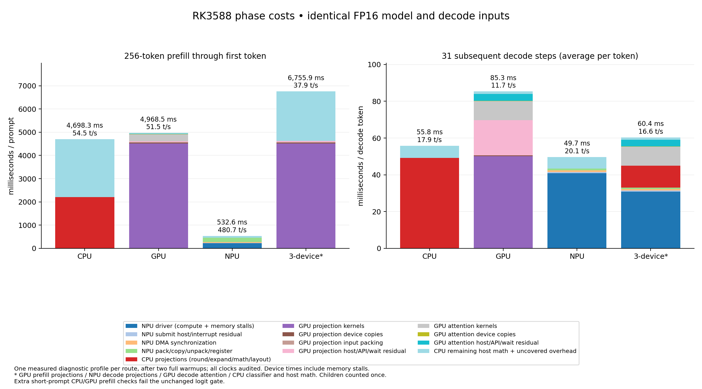

# Complete phase cost profiles — WIP

All four representative routes have complete 256-token prefill and 31-step decode profiles. Root-stage coverage is 99.9441–99.9992%; every tested prediction matches and every requested CPU/GPU/NPU/DDR clock holds. Original clock settings are restored.

Each diagnostic uses two complete warmups and one measured request, starting at ≤50°C. OpenCL event profiling and additional host timers are enabled; use the [phase matrix](PHASES.md) for unprofiled performance ranges. The independent [single-change complete-request comparisons](ITERATIONS.md) now include phase and complete-request ranges at a common 51°C start limit.

## Phase totals

| Projection route | Prefill / TTFT ms | Effective prefill t/s | Decode ms/token | Decode t/s |
|---|---:|---:|---:|---:|
| cpu | 4698.258 | 54.49 | 55.823 | 17.914 |
| gpu | 4968.484 | 51.52 | 85.349 | 11.717 |
| npu | 532.558 | 480.70 | 49.677 | 20.130 |
| all | 6755.892 | 37.89 | 60.367 | 16.565 |

## Inclusive root stages

Each root includes its own packing, conversion, transfer, synchronization and host math. Child device details below are part of these roots and must not be added to them again. Cache layout on the first decode call is timed inside decode.

### prefill: milliseconds per prompt

| Stage | CPU | GPU | NPU | Three-device route |
|---|---:|---:|---:|---:|
| cache_layout | 0.000 | 0.000 | 0.000 | 0.000 |
| embedding | 0.123 | 0.128 | 0.131 | 0.116 |
| attention_norm | 3.267 | 1.337 | 1.158 | 1.606 |
| qkv | 568.478 | 1239.457 | 75.746 | 1239.336 |
| qk_norm_rope | 16.484 | 7.407 | 6.294 | 7.662 |
| kv_write | 4.782 | 5.254 | 4.906 | 5.281 |
| attention | 2417.823 | 313.034 | 227.295 | 2094.219 |
| wo | 306.950 | 613.370 | 65.344 | 619.830 |
| residual_ffn_norm | 5.690 | 3.786 | 2.313 | 4.033 |
| ffn | 1342.619 | 2766.290 | 136.379 | 2767.168 |
| ffn_residual | 3.788 | 3.989 | 1.996 | 3.766 |
| final_norm | 0.002 | 0.003 | 0.002 | 0.002 |
| classifier | 27.573 | 13.751 | 10.315 | 12.199 |
| sampling | 0.634 | 0.620 | 0.633 | 0.624 |

### decode: average milliseconds per subsequent token

| Stage | CPU | GPU | NPU | Three-device route |
|---|---:|---:|---:|---:|
| cache_layout | 0.476 | 0.000 | 0.455 | 0.000 |
| embedding | 0.001 | 0.001 | 0.001 | 0.001 |
| attention_norm | 0.061 | 0.047 | 0.051 | 0.047 |
| qkv | 10.157 | 17.568 | 8.788 | 8.816 |
| qk_norm_rope | 0.195 | 0.153 | 0.120 | 0.109 |
| kv_write | 0.119 | 0.037 | 0.111 | 0.036 |
| attention | 4.488 | 14.190 | 4.406 | 13.963 |
| wo | 4.996 | 8.434 | 5.185 | 5.121 |
| residual_ffn_norm | 0.121 | 0.091 | 0.068 | 0.053 |
| ffn | 22.482 | 30.388 | 19.601 | 19.534 |
| ffn_residual | 0.073 | 0.052 | 0.024 | 0.023 |
| final_norm | 0.002 | 0.001 | 0.001 | 0.001 |
| classifier | 11.985 | 13.747 | 10.224 | 12.020 |
| sampling | 0.637 | 0.626 | 0.626 | 0.629 |

## Additional numerical limits

The displayed 256-token profiles pass their numerical gates. Extra 24-token
checks fail the unchanged first-logit `<0.001` gate for CPU/GPU prefill and the
three-device route, despite all 16 greedy predictions matching. GPU prefill
also fails at 73 tokens. These implementations remain WIP diagnostics; this
profile does not establish general route correctness. The selected NPU-prefill
reference passes with bit-identical logits. See [PHASES.md](PHASES.md).

## Transfer and wait accounting

The exact component values are in `phase-costs.json`. GPU event intervals represent command execution, including memory stalls. NPU `hw_elapse_time` is in nanoseconds and includes commit-to-completion/interrupt time. Neither is a pure ALU-compute measurement.

| Measured component | Prefill ms | Decode ms/token |
|---|---:|---:|
| GPU projection kernels | 4513.403 | 50.194 |
| GPU projection device copies | 43.187 | 0.372 |
| GPU projection input packing | 20.247 | 0.087 |
| GPU projection host/API/wait residual | 40.922 | 19.129 |
| GPU attention kernels | 287.717 | 10.304 |
| GPU attention device copies | 14.720 | 0.097 |
| GPU attention host/API/wait residual | 10.571 | 3.783 |
| NPU driver (compute + memory stalls) | 224.166 | 40.903 |
| NPU submit host/interrupt residual | 9.562 | 0.615 |
| NPU DMA synchronization | 36.604 | 0.993 |
| NPU pack/copy/unpack/register | 180.941 | 0.800 |

The GPU projection path executes 197 host/device round trips per model step. It keeps all FP16 weights resident, but uploads rounded activations and performs a blocking output read for every projection. Its measured decode projection residual is 19.129 ms/token beyond kernel execution, device-copy events and input packing; that residual includes host API/queue/wait and profiling costs. GPU attention is another 14.184 ms/token, with softmax at 5.310 ms/token. Tiny copy-event durations do not prove that transfer/synchronization overhead is negligible.
The CPU prefill root has 2,417.823 ms in attention. Dense projections take 2,200.317 ms: 33.189 ms input rounding, 130.433 ms FP16 weight expansion, 1,924.004 ms BLAS, 84.687 ms result layout, and 27.940 ms GEMV/loop overhead. Norms/RoPE/residuals remain separate roots.

### Fused GPU decode attention diagnostic

A new 256-token NPU-projection / fused-GPU-attention profile passes numerical,
device, clock and restoration audits. It uses a common <=51°C start limit,
two complete warmups and one measurement, with event profiling enabled.
Decode root-stage coverage is 99.9744%. Per subsequent token:

| GPU attention component | ms/token |
|---|---:|
| Q×K score kernel | 2.318 |
| Fused softmax/P×V kernel | 3.506 |
| Device copy events | 0.101 |
| Host/API/queue/wait/event-collection residual | 3.176 |
| Total GPU attention wall | 9.101 |

There are 56 attention kernel launches per token. Device intervals include
memory stalls. The blocking-read API waits for preceding commands and must
not be added to these components as pure download time. Profiling overhead
is present; use [ITERATIONS.md](ITERATIONS.md) for the matched unprofiled
CPU-versus-fused-GPU result. This diagnostic is not a paired fusion-versus-old-GPU
speed claim. [Derived values](fused-attention-costs51.json),
[independent audit](fused-costs25651-audit.json) and raw evidence are retained.

## Decode versus the measured memory roofline

Use the exact algorithmic weight payload `1,191,968,768` bytes/token and the measured three-core NPU native streamed-weight rate `30.941 GB/s`. This yields a weight-only ceiling of `25.958` t/s; 90% is `23.362` t/s.

The complete profiled NPU route delivers **23.994 useful GB/s (77.5% of the measured stream rate)**. We are **below 90% for whole-model decode**. Dividing the same payload by driver time alone gives 29.141 useful GB/s (94.2%); CPU attention/sampling/layout and synchronization account for much of the remaining request time.
These are weight-payload/time ratios, not observed DDR transactions. This board exposes no supported actual DRAM-byte counter, so 90% actual memory-bus utilization is not established. Padding, activation/cache traffic, driver scheduling and CPU/GPU contention are not counted as useful weight bytes.

## Independent candidates before complete-request decisions

The [YALM profiling article](https://andrewkchan.dev/posts/yalm.html) motivates measuring full-model stages, changing one kernel/layout decision at a time and checking output quality before interpreting speed. The RK3588 experiments use local device/driver timers; CUDA-specific profiling counters are unavailable here.

- Pack the eight shared KV heads once, preserving original native payloads, DMA requests and NPU submit flags; target shared KV packing (21.925 ms here) within the 180.941 ms NPU prefill packing/copy/unpack/register component. Input native packing is 55.399 ms and output copy/unpack/reduction 86.779 ms, so KV reuse can address only part of that total.
- Use a cooperative GPU softmax, then separately fuse softmax/P×V; primitive and five-prompt model checks pass. Fused GPU decode attention is still slower than CPU in the new independently timed complete-request comparison; a matched fusion-versus-unfused performance comparison remains pending.
- Reuse 16 regular GEMM prompt rows with one FP32 accumulator set; six actual-weight GPU projection cases pass.
- Replace repeated CPU prompt-attention dot/value loops with SGEMM over the same FP16-rounded values. Four primitive cases / 985,088 outputs pass `1e-4`, maximum observed relative RMSE `1.20862711335e-6`; complete-model 24/73-token logits fail the unchanged gate. This candidate remains rejected for general use, with no qualified performance gain.
- Increase only NPU attention batches to 128 rows inside the existing four-data-bank guard. Primitive and five-prompt model checks pass. The matched prefill throughput gain is 4.71–4.84%; complete-request ranges overlap, so a reliable complete-request win is not established.
- Judge the tested candidates using an independent resident-model request timer, not only a kernel or phase speedup. Include prefill-to-decode cache preparation and all activation transfers/waits.

Raw configs/logs/inputs/clock samples are in `evidence/phase-costs`; `costs-audit.json` checks source/binary/model hashes, actual device counts, predictions, numerical gates, root coverage, driver intervals and restored clocks. `phase-costs.json` records the non-overlapping derived decomposition. The selected runner is unchanged.

INTENT: the selected runner has NPU projections and a tested GPU-attention route but no full CPU/GPU projection comparison; the user requests device combinations and stepwise profiling/optimization; fp16/README.md specifies the shared FP16 checkpoint, native NPU projection reference and numerical verification.

AUTH: user said "wip commit per milestone".
