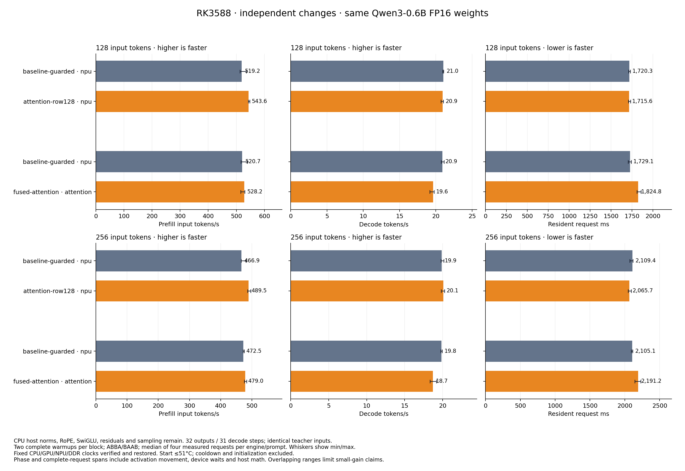

# Independent phase and complete-request comparisons

Both experiments pass independent model/source/binary, numerical, device-count,
clock and restoration audits. Each uses the shared Qwen3-0.6B FP16 checkpoint,
identical teacher-forced inputs, 32 outputs and every actual predicted ID.
There are two full warmups and two measurements per prompt per block, with
ABBA/BAAB blocks and reversed prompt order in the second half. The tables
recompute medians from all four individual measurements per engine/prompt.
Every request starts at <=51°C. Warmup, initialization and cooling are excluded.

Complete-request time is independently captured from prefill start through
the last output. Packing, activation transfers, cache preparation, DMA sync,
device/queue waits and interphase work are included. Input-ID file reading and
tokenization are excluded. Effective prefill = input tokens / TTFT, including
classifier and sampling; decode covers 31 subsequent tokens.

[PNG](../../yalm-iterations.png) · [JPG](../../yalm-iterations.jpg) · [SVG](../../yalm-iterations.svg)

## NPU attention batch 128

| Input tokens | Engine / decode attention | TTFT ms | Prefill t/s | Decode t/s | Request ms | Request min–max ms |
|---|---|---:|---:|---:|---:|---:|
| 128 | Original / CPU | 246.552 | 519.16 | 21.041 | 1720.262 | 1709.823–1730.242 |
| 128 | Batch 128 / CPU | 235.450 | 543.64 | 20.934 | 1715.580 | 1709.110–1732.947 |
| 256 | Original / CPU | 548.262 | 466.93 | 19.861 | 2109.424 | 2071.545–2115.833 |
| 256 | Batch 128 / CPU | 522.929 | 489.55 | 20.096 | 2065.679 | 2047.356–2090.752 |

| Input tokens | Prefill throughput change | Decode throughput change | Complete-request throughput change | Overlapping ranges: prefill / decode / request |
|---|---:|---:|---:|---|
| 128 | +4.71% | -0.50% | +0.27% | no / yes / yes |
| 256 | +4.84% | +1.19% | +2.12% | no / yes / yes |

[Audited raw aggregation](iteration-row128-e2e51-report.json) records all phase/request ranges, individual observations and audit hashes.

Attention batch 128 improves prefill throughput by 4.71–4.84%, with
non-overlapping observed TTFT ranges. Request median throughput improves
only 0.27% / 2.12%, with overlapping observed request ranges. Decode ranges
also overlap. Four observations are not confidence intervals; a reliable
complete-request improvement is not established and no candidate is promoted.
The existing five-prompt quality and complete primitive checks are in [CANDIDATES.md](CANDIDATES.md).

## Fused GPU decode attention versus CPU

| Input tokens | Engine / decode attention | TTFT ms | Prefill t/s | Decode t/s | Request ms | Request min–max ms |
|---|---|---:|---:|---:|---:|---:|
| 128 | Original / CPU | 245.827 | 520.69 | 20.901 | 1729.068 | 1704.365–1741.010 |
| 128 | Original / fused GPU | 242.351 | 528.16 | 19.632 | 1824.778 | 1811.113–1859.442 |
| 256 | Original / CPU | 541.798 | 472.50 | 19.841 | 2105.065 | 2093.849–2111.105 |
| 256 | Original / fused GPU | 534.494 | 478.96 | 18.712 | 2191.181 | 2144.312–2229.578 |

| Input tokens | Prefill throughput change | Decode throughput change | Complete-request throughput change | Overlapping ranges: prefill / decode / request |
|---|---:|---:|---:|---|
| 128 | +1.43% | -6.07% | -5.25% | yes / no / no |
| 256 | +1.37% | -5.69% | -3.93% | yes / no / no |

[Audited raw aggregation](iteration-fused-gpu-vs-cpu-e2e51-report.json) records all phase/request ranges, individual observations and audit hashes.

Fused GPU decode attention lowers decode throughput by 6.07% / 5.69% and increases request latency by 5.54% / 4.09%.
Decode and request ranges do not overlap. Prefill ranges overlap; both
routes retain original NPU prefill. CPU decode attention remains selected.
This is a direct CPU-versus-fused-GPU comparison, not a matched measurement
of fusion speedup against the older unfused GPU prototype.

## Limits and device placement

The host transformer still runs embedding, norms, RoPE, SwiGLU, residuals and
sampling on CPU. Dense projections use the native register NPU backend in
both experiments; the GPU candidate replaces decode attention through Mali
OpenCL. This milestone did not implement concurrent FFN channel partitioning.
The subsequent [concurrent experiment](CONCURRENT.md) now tests that execution.
The results cover 128/256-token prompts and context 512, with cooled requests
at fixed clocks; they do not establish sustained hot-loop throughput.
The older entire 50°C partial request sweep remains rejected and is not used.
CPU/GPU prefill short-prompt logit failures remain retained; these two
comparisons use qualified NPU prefill and do not resolve those failures.

Source/binary and audit records are frozen under `evidence/iteration-*`.
The shared model, full vocabulary logits and compiled binaries remain in
`/home/orangepi/qwen3-bench/matched/roofline/yalm` with hashes retained.

INTENT: the selected runner has NPU projections and a tested GPU-attention route but no full CPU/GPU projection comparison; the user requests device combinations and stepwise profiling/optimization; fp16/README.md specifies the shared FP16 checkpoint, native NPU projection reference and numerical verification.

AUTH: user said "wip commit per milestone".
