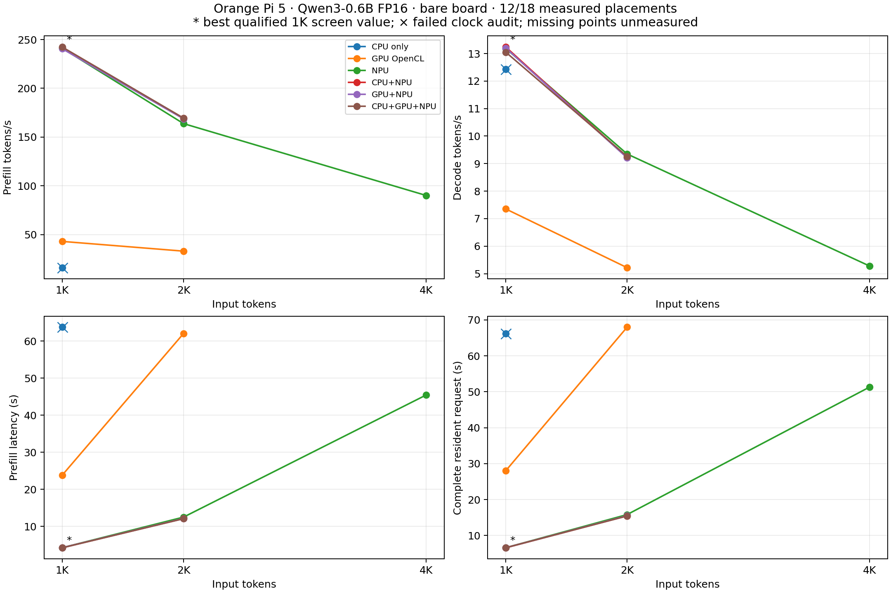

# 1K / 2K / 4K prompt benchmark

12/18 placements were measured. 11/12 measured rows pass both the unchanged numerical gate and the exact sampled-clock check.

The bare-board sweep stopped normally at the cooling guard during CPU 2K: after the first warmup and 180 seconds of cooling, the board was still 55.461°C, above the common 55°C start limit. No CPU 2K measured request or subsequent non-NPU 4K job ran. The CPU 1K row also failed the strict clock check: its active CPU stayed at 1.8GHz, but the idle NPU/GPU clocks dropped. All clock governors/limits and the original fan command were restored. The full comparison remains incomplete; use a fresh session after fitting cooling.

The aborted CPU 2K warmup matched all generated IDs but had first-logit relative RMSE 0.00111339, above the unchanged 0.001 gate. It is retained as a failed diagnostic, with zero measured requests. Installing cooling does not establish numerical correctness; investigate this difference before accepting a future CPU 2K row.

## Same-model screening comparison

| Input tokens | Placement | Prefill ms ↓ | Prefill tokens/s ↑ | Decode tokens/s ↑ | Request ms ↓ | Audit |
|---|---|---:|---:|---:|---:|---|
| 1024 | CPU only | 63751.00 | 16.06 | 12.43 | 66245.42 | clock fail |
| 1024 | GPU OpenCL | 23820.43 | 42.99 | 7.35 | 28037.46 | pass |
| 1024 | NPU | 4246.48 | 241.14 | 13.19 | 6597.71 | pass |
| 1024 | CPU+NPU | 4229.70 | 242.10 | **13.24**\* | **6572.43**\* | pass |
| 1024 | GPU+NPU | 4256.27 | 240.59 | 13.20 | 6604.64 | pass |
| 1024 | CPU+GPU+NPU | **4225.21**\* | **242.35**\* | 13.05 | 6600.76 | pass |
| 2048 | CPU only | — | — | — | — | not measured: cooldown abort |
| 2048 | GPU OpenCL | 62036.77 | 33.01 | 5.22 | 67978.29 | pass |
| 2048 | NPU | 12501.28 | 163.82 | 9.35 | 15816.94 | pass |
| 2048 | CPU+NPU | 12096.94 | 169.30 | 9.22 | 15457.58 | pass |
| 2048 | GPU+NPU | 12139.49 | 168.71 | 9.21 | 15505.91 | pass |
| 2048 | CPU+GPU+NPU | 12082.94 | 169.50 | 9.26 | 15430.26 | pass |
| 4096 | CPU only | — | — | — | — | not run |
| 4096 | GPU OpenCL | — | — | — | — | not run |
| 4096 | NPU | 45443.88 | 90.13 | 5.28 | 51320.79 | pass |
| 4096 | CPU+NPU | — | — | — | — | not run |
| 4096 | GPU+NPU | — | — | — | — | not run |
| 4096 | CPU+GPU+NPU | — | — | — | — | not run |

\* Best observed **qualified** value where all six placements were measured (1K only in this partial sweep). Two measured requests per row constitute a screen; asterisks do not denote statistical significance. Failed rows are diagnostics and cannot win. Missing cells have no extrapolated timing.

Mixed rows split FFN gate/up channels during decoding only (CPU 96 and/or GPU 96 channels, with the remaining channels on NPU). Their prefill follows the same NPU path. Small prefill differences among these rows are run variation. CPU host operations remain present in every accelerated placement.

CPU only runs projections and attention on CPU with no NPU/GPU execution. GPU OpenCL runs both projections and attention on Mali using the custom kernels, with CPU embedding, normalization, RoPE, SwiGLU, residuals and sampling. The NPU route offloads dense matrices and prompt QK/PV to native registers, with CPU decode attention. These GPU results do not represent a tuned, GPU-resident llama.cpp baseline.

[PNG](long-context-comparison.png) · [JPG](long-context-comparison.jpg) · [SVG](long-context-comparison.svg)

## Protocol and correctness

The device tree identifies Orange Pi 5 / RK3588S, and the user reports no heatsink installed. These are current bare-board measurements, with sampled temperatures reaching 85.888°C in CPU 1K. PWM commands do not establish physical fan presence or cooling effectiveness. A heatsink with a fan is recommended; [52Pi EP-0167](https://wiki.52pi.com/index.php?title=EP-0167) is specified by its manufacturer for the original Orange Pi 5. A future cooler installation needs a separate benchmark session.

All rows use the same pinned Qwen3-0.6B revision `c1899de289a04d12100db370d81485cdf75e47ca` and shared FP16 container `c92807935bfbb81f6628e9c2723267da367577a3f2b1bb2530b87bf5e5bba879`. Effective weight tensors and weight quantization match. Intermediate precision and reduction order can differ: CPU prompt attention uses FP32, whereas NPU/Mali prompt attention uses FP16 operands. These are checked by the unchanged logit gate. The original 512-token container header is unchanged; the isolated runner expands runtime KV/scratch capacity to 4128. The model configuration permits 40960 positions with RoPE base 1e6. The selected executable `100716de...` remains unchanged.

Each measured request starts at <=55°C. CPU/NPU/Mali/DDR targets are 1.800/1.000/1.000/2.112GHz, with four inference threads on CPU4–7. Clocks are sampled every 250ms and original governors/limits restored. Fan PWM255 is a common feedback setpoint, reasserted when the kernel temperature notifier changes it, with 10ms polling on CPU0–3. Raw PWM samples, all reassertions and maximum polling gap are retained. Kernel thermal protection remains active, and the original fan setting is restored afterward.

Two complete warmups precede two measured requests per measured row. Each request has 32 output tokens and 31 decode steps. Prefill tokens/s is input tokens divided by the measured span through the first classifier/argmax. Decode tokens/s is 31 divided by the decode span. Request time is independently measured from prefill start through the last argmax. Activation packing, memory movement, DMA synchronization, host work, queue waits and handoffs are included. Loading, tokenization, ID-file reading, cooldown and warmups are excluded.

All routes use identical input IDs and identical teacher IDs during decoding. The NPU references run without teacher forcing, and every actual prediction from all four requests is retained and checked. Full-vocabulary first logits must be finite and have relative RMSE<0.001 against the checked long NPU reference. This reference is not an independent Hugging Face full-model oracle.

The [wide QK/PV checks](long-context/wide-attention-check.jsonl) compare 514048 outputs against double accumulation of identical FP16 operands. Maximum relative RMSE 2.02905781962e-7 passes the unchanged 1e-5 gate. All six short regressions pass, and [all 151936 first logits are bit-identical to the prior corresponding routes](long-context/long-context-short-parity.json). Native PV submissions retain the four-data-bank limit and use 64/32/16 query rows at 1K/2K/4K.

The [immutable prompts](long-context/prompts/provenance.json) repeat the existing 128-token benchmark prompt and take nested prefixes of exactly 1024/2048/4096 tokens. They measure synthetic throughput, rather than natural long-document task quality.

## Raw measured ranges and checks

| Input | Placement | Prefill min–max ms | Decode min–max tokens/s | Request min–max ms | First-logit relative RMSE | All actual IDs match |
|---|---|---:|---:|---:|---:|---|
| 1024 | CPU only | 63698.372–63803.618 | 12.308–12.550 | 66168.475–66322.372 | 0.00096904935 | True |
| 1024 | GPU OpenCL | 23814.192–23826.678 | 7.348–7.355 | 28029.321–28045.593 | 0.0007862517 | True |
| 1024 | NPU | 4222.575–4270.392 | 13.043–13.329 | 6596.130–6599.295 | 0 | True |
| 1024 | CPU+NPU | 4189.175–4270.224 | 12.983–13.492 | 6486.914–6657.951 | 0 | True |
| 1024 | GPU+NPU | 4231.611–4280.939 | 13.113–13.290 | 6564.291–6644.989 | 0 | True |
| 1024 | CPU+GPU+NPU | 4187.703–4262.719 | 12.961–13.140 | 6547.000–6654.527 | 0 | True |
| 2048 | GPU OpenCL | 62031.626–62041.911 | 5.204–5.231 | 67968.300–67988.277 | 0.00098512171 | True |
| 2048 | NPU | 12292.580–12709.983 | 9.293–9.407 | 15628.563–16005.315 | 0 | True |
| 2048 | CPU+NPU | 12063.078–12130.810 | 9.197–9.252 | 15433.843–15481.325 | 0 | True |
| 2048 | GPU+NPU | 12071.907–12207.081 | 9.129–9.290 | 15409.020–15602.791 | 0 | True |
| 2048 | CPU+GPU+NPU | 11936.147–12229.724 | 9.252–9.271 | 15280.035–15580.495 | 0 | True |
| 4096 | NPU | 45378.277–45509.487 | 5.269–5.281 | 51248.645–51392.943 | 0 | True |

Min–max spans contain only two observations; they are not confidence intervals. The run order is retained in the execution plan. No counterbalanced long-context speedup or fresh stock-RKLLM comparison is claimed.

## Phase findings and next checks

In the second measured CPU 1K request, prompt attention took 52939.918ms of 63803.618ms prefill (about 83%). Its linear calls took 10405.982ms, including 162.843ms packing. CPU prompt attention is the main measured bottleneck in that row. At 1K the mixed placements keep the same NPU prefill path, and their small differences overlap the measured NPU range; this screen does not establish a repeatable mixed-device gain.

The resident request span includes packing, transfers, synchronization and host work. It is separately timed; a faster individual phase is insufficient evidence of an end-to-end gain. Existing [transfer and compute profiles](COSTS.md) and [roofline measurements](../../ROOFLINE.md) remain separate artifacts. Wall spans and logical byte counts do not measure physical DDR traffic. The GPU baseline uses custom OpenCL kernels and is not a tuned GPU-resident llama.cpp baseline.

After installing cooling, create a fresh output namespace and rerun all six placements at each prompt length, including new NPU references. Keep the same numerical gate and measured request protocol. Preserve the current bare-board session; do not combine it with cooled results. Check the CPU 2K logit difference, stable clock samples and restoration before comparing winners.

## Reproducibility

[Independent 12-row audit](long-context/long-context-audit.json) · [execution plan](long-context/long-context-execution-plan-screen55-cpu1800-fanheld.json) · [cooling-control audit](long-context/long-context-cooling-restoration.json) · [aborted warmup audit](long-context/long-context-cpu2048-abort-audit.json) · [source/checklist](long-context/long-context-plan.md)

The first 51°C attempt stopped normally at the bounded cooldown guard before the second 4K warmup; GPU clock drops were also observed. A subsequent 55°C attempt showed that a one-time fan setting is overridden by the kernel. These attempts are retained as rejected diagnostics and excluded from this table. The later 2.256GHz CPU 1K row also thermally dropped to 2.208GHz; this partial comparison uses a common 1.800GHz CPU target for all measured rows. The max-clock NPU/GPU timings remain separate diagnostics. The [board kernel source](https://github.com/orangepi-xunlong/linux-orangepi/blob/orange-pi-6.1-rk35xx/drivers/hwmon/pwm-fan.c) implements that temperature notifier.

The exported `long-context/build.py` reproduces isolated runner `f8b4f9eb...`. Full source, model, binary, input, raw-log and logit hashes are recorded in provenance/audits. Small raw evidence is exported losslessly; checkpoint, executables and binary logits remain in `/home/orangepi/qwen3-bench/matched/roofline/yalm/e2e/long-context`. All NPU initialization/sync/submits ran serially. No push was requested.

INTENT: the benchmark runner and attention scratch are limited to 512 tokens; the user requests 1024/2048/4096-token prompts with CPU/OpenCL/NPU combinations; fp16/README.md specifies pinned shared FP16 weights, measured phase/request spans and numerical checks.

AUTH: user said "wip commit per milestone".
