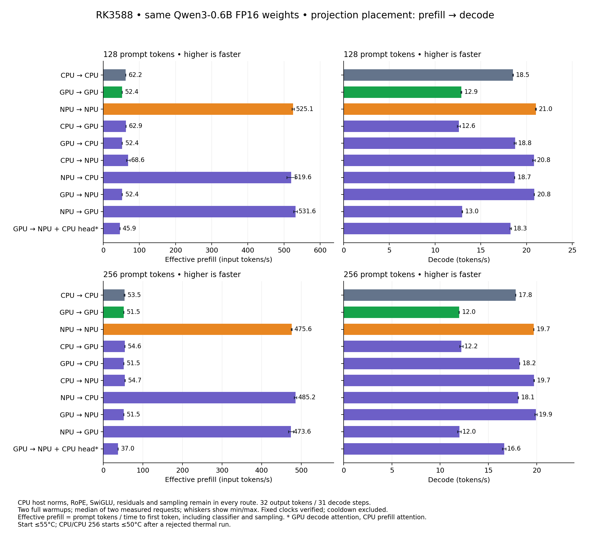

# Phase placement measurements — WIP

All nine CPU/GPU/NPU projection-backend pairs were measured for 128 and 256 input tokens, plus an explicit three-device placement. Every row reports prefill time, effective prefill tokens/s and decode tokens/s. The selected `runq-fp16` remains unchanged.

**These are transfer-inclusive phase timings.** Complete phase costs are in [COSTS.md](COSTS.md), and the separately measured complete requests are in [REQUESTS.md](REQUESTS.md). Model initialization, input file reading/tokenization, full warmups and thermal cooldown are excluded; the final classifier and sampling are included in TTFT.

## Same workload and precision

- Shared `Qwen/Qwen3-0.6B` FP16 container, SHA256 `c92807935bfbb81f6628e9c2723267da367577a3f2b1bb2530b87bf5e5bba879`; pinned revision and all effective tensor hashes are in the FP16 manifest.
- Context 512; identical prompt IDs; 32 outputs / 31 timed decode steps; EOS 151645 suppressed; two full warmups and two measured requests per row.
- Teacher-forced decode inputs equal the reference IDs. Every actual greedy prediction, including warmups, must still match. The unchanged first-prefill-logit relative RMSE gate is `<0.001`.
- FP16 projection weights/rounded inputs, FP32 accumulation/output. CPU prefill temporarily expands exact FP16 values for OpenBLAS. Attention prefill uses FP16 operands/probabilities; decode uses FP32 KV and math. Reduction order differs across devices.
- Four host threads on CPU cores 4–7. Fixed CPU 2.256GHz, NPU 1GHz, GPU 1GHz, DDR 2.112GHz; every recorded clock is checked and governors restored. All hardware processes run serially.

## Placements

Device names below describe dense projections. Norms, RoPE, SwiGLU, residuals, embedding and sampling run on CPU in every row. The GPU route has GPU projections and attention with CPU host math; it is not a fully GPU-resident transformer. No concurrent partition of one projection across devices is implemented.

| Route | Prefill / decode projections | Prefill / decode attention | CPU classifier |
|---|---|---|---|
| cpu | CPU / CPU | CPU / CPU | no |
| gpu | GPU / GPU | GPU / GPU | no |
| npu | NPU / NPU | NPU + CPU softmax / CPU | no |
| cpu_gpu | CPU / GPU | CPU / GPU | no |
| gpu_cpu | GPU / CPU | GPU / CPU | no |
| cpu_npu | CPU / NPU | CPU / CPU | no |
| npu_cpu | NPU / CPU | NPU + CPU softmax / CPU | no |
| gpu_npu | GPU / NPU | GPU / CPU | no |
| npu_gpu | NPU / GPU | NPU + CPU softmax / GPU | no |
| all | GPU / NPU | CPU / GPU | yes |

## 128 input tokens

| Route | Prefill / TTFT ms | Effective prefill t/s | Decode t/s | TTFT min–max ms | Decode min–max t/s |
|---|---:|---:|---:|---:|---:|
| cpu | 2057.807 | 62.20 | 18.526 | 2057.703–2057.912 | 18.502–18.549 |
| gpu | 2444.542 | 52.36 | 12.873 | 2444.178–2444.905 | 12.829–12.917 |
| npu | 243.751 | 525.13 | 21.020 | 242.366–245.136 | 20.971–21.068 |
| cpu_gpu | 2036.068 | 62.87 | 12.601 | 2035.977–2036.159 | 12.439–12.762 |
| gpu_cpu | 2441.151 | 52.43 | 18.754 | 2437.919–2444.384 | 18.651–18.856 |
| cpu_npu | 1866.662 | 68.57 | 20.806 | 1733.831–1999.493 | 20.661–20.952 |
| npu_cpu | 246.355 | 519.58 | 18.688 | 240.744–251.966 | 18.666–18.709 |
| gpu_npu | 2443.345 | 52.39 | 20.840 | 2439.628–2447.062 | 20.831–20.850 |
| npu_gpu | 240.778 | 531.61 | 12.958 | 238.469–243.086 | 12.936–12.980 |
| all | 2789.649 | 45.88 | 18.257 | 2789.226–2790.071 | 18.184–18.330 |

## 256 input tokens

| Route | Prefill / TTFT ms | Effective prefill t/s | Decode t/s | TTFT min–max ms | Decode min–max t/s |
|---|---:|---:|---:|---:|---:|
| cpu | 4783.807 | 53.51 | 17.817 | 4712.157–4855.457 | 17.812–17.822 |
| gpu | 4970.322 | 51.51 | 11.961 | 4968.991–4971.652 | 11.947–11.975 |
| npu | 538.246 | 475.62 | 19.702 | 537.245–539.248 | 19.700–19.704 |
| cpu_gpu | 4688.910 | 54.60 | 12.194 | 4677.514–4700.307 | 12.027–12.361 |
| gpu_cpu | 4968.826 | 51.52 | 18.227 | 4968.284–4969.368 | 18.214–18.239 |
| cpu_npu | 4679.575 | 54.71 | 19.729 | 4657.049–4702.102 | 19.700–19.758 |
| npu_cpu | 527.593 | 485.22 | 18.087 | 524.196–530.990 | 18.052–18.123 |
| gpu_npu | 4967.127 | 51.54 | 19.913 | 4966.213–4968.040 | 19.796–20.031 |
| npu_gpu | 540.514 | 473.62 | 11.988 | 533.252–547.775 | 11.806–12.171 |
| all | 6924.523 | 36.97 | 16.627 | 6924.399–6924.647 | 16.444–16.811 |

## Additional short-prompt limits

The 20 displayed 128/256-token rows pass their unchanged numerical gates.
Additional 24-token checks reveal first-prefill-logit disagreement above `0.001`
for CPU prefill (`0.001838625`), GPU prefill (`0.001487014`) and the explicit
three-device route (`0.001141505`). GPU prefill also fails on the 73-token case
(`0.001926848`). Every tested prediction still matches, but these failures are
retained and **the affected routes are not qualified for general deployment**.
Timings remain finite-case implementation diagnostics. NPU-prefill routes pass
the added 24-token check with bit-identical first logits. See [COSTS.md](COSTS.md)
and `evidence/short-prompt-quality` / `evidence/gpu-extra-quality`.

## Qualification and rejected runs

All 20 accepted rows pass the unchanged logit gate and every generated-ID comparison. The largest observed relative RMSE is `0.000669901058`.
The initial unrestricted sweep was rejected after thermal clock changes. A sweep cooling every request to 55°C had five GPU-clock drops only in its final CPU/CPU 256-token job; the complete failed suite remains intact. The other 19 whole jobs pass the unchanged clock targets and output gate and are retained in `phase-qualified`. The affected CPU job was rerun with a 50°C start target and independently audited. This temperature difference is explicit. The independent single-change [complete-request comparisons](ITERATIONS.md) use one shared 51°C start limit; the earlier 50°C partial request sweep is rejected in full.
The fan PWM was already at its maximum exposed value, 255. No fan or thermal policy was changed. These short cooled-request measurements do not establish sustained hot-loop throughput.
Raw logs, inputs, configurations, compressed clock samples, source hashes and audit are under `evidence/`. The shared model and full vocabulary logits remain in `/home/orangepi/qwen3-bench/matched/roofline/yalm`; their hashes and exact paths are retained. `make fp16-routes` produced the exact benchmark SHA256 `11d2f9b753cf887a11bd3cdb34d1784127184a099d7fa2382601d46b77ef091a`.

The CPU/GPU backends are measured implementations in this experiment, not claims about the fastest possible llama.cpp or GPU engine. Older paired stock RKLLM results remain in [ROOFLINE.md](../../ROOFLINE.md); these phase rows are not a new paired stock comparison.

INTENT: the selected runner has NPU projections and a tested GPU-attention route but no full CPU/GPU projection comparison; the user requests device combinations and stepwise profiling/optimization; fp16/README.md specifies the shared FP16 checkpoint, native NPU projection reference and numerical verification.

AUTH: user said "wip commit per milestone".
