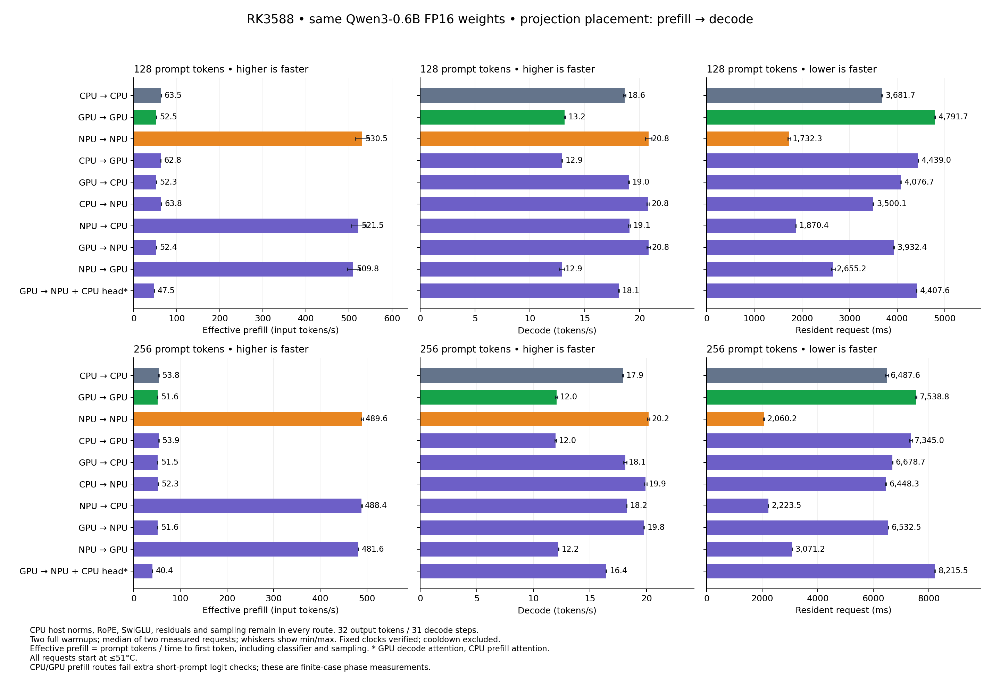

# Complete resident-model request placement comparison

All twenty 128/256-token rows pass independent model/source/binary, numerical,
actual-device-count, clock and restoration audits. All nine CPU/GPU/NPU
projection pairs and the explicit three-device route were tested. Every
request starts at <=51°C with a bounded idle cooldown. The entire older
50°C partial request sweep remains rejected; none of its rows are reused.

All rows use the same pinned Qwen3-0.6B FP16 checkpoint and exact input IDs,
context 512, 32 outputs, two complete warmups and two measured requests.
Decode inputs are the same teacher IDs and every actual greedy prediction
is checked, including warmups. Effective prefill = prompt tokens / TTFT;
TTFT includes the classifier and sampling. Decode covers 31 subsequent tokens.

Request time is independently captured from prefill start through the last
output, including activation packing, copies, cache preparation, DMA sync,
device/queue waits and interphase work. Model initialization, pre-request
cooling, tokenization/input-ID reading and post-request reporting are excluded.
This is resident-model inference latency, not cold-start process latency.

CPU/GPU/NPU/DDR clocks are fixed, sampled and restored. Warmups and measured
requests must hold all recorded targets. The common start limit does not
establish sustained hot-loop throughput. No fan or thermal policy is changed.

Route names describe projection placement; [PHASES.md](PHASES.md) records
attention and classifier placements. Embedding, norms, RoPE, SwiGLU,
residuals and sampling remain CPU operations. GPU measurements use the
current custom Mali OpenCL implementation, not a fully GPU-resident
transformer or a fastest-possible llama.cpp claim. Execution dependencies
are serial; no concurrent partition of one FFN matrix is implemented.

[PNG](../../yalm-request-matrix.png) · [JPG](../../yalm-request-matrix.jpg) · [SVG](../../yalm-request-matrix.svg)

## 128 input tokens

| Prefill → decode projections | TTFT ms | Prefill t/s | Decode t/s | Request ms | Output t/s across request | Request min–max ms |
|---|---:|---:|---:|---:|---:|---:|
| cpu → cpu | 2016.056 | 63.49 | 18.613 | 3681.672 | 8.692 | 3671.401–3691.943 |
| gpu → gpu | 2437.915 | 52.50 | 13.171 | 4791.720 | 6.678 | 4784.770–4798.671 |
| npu → npu | 241.270 | 530.52 | 20.795 | 1732.328 | 18.472 | 1703.146–1761.510 |
| cpu → gpu | 2038.963 | 62.78 | 12.916 | 4439.035 | 7.209 | 4436.821–4441.248 |
| gpu → cpu | 2446.108 | 52.33 | 19.013 | 4076.659 | 7.850 | 4073.430–4079.889 |
| cpu → npu | 2006.554 | 63.79 | 20.757 | 3500.114 | 9.143 | 3493.533–3506.696 |
| npu → cpu | 245.453 | 521.48 | 19.078 | 1870.419 | 17.108 | 1869.697–1871.140 |
| gpu → npu | 2441.966 | 52.42 | 20.802 | 3932.367 | 8.138 | 3921.312–3943.423 |
| npu → gpu | 251.082 | 509.79 | 12.901 | 2655.166 | 12.052 | 2612.690–2697.641 |
| GPU → NPU + CPU head / GPU decode attention | 2693.231 | 47.53 | 18.083 | 4407.646 | 7.260 | 4404.180–4411.112 |

## 256 input tokens

| Prefill → decode projections | TTFT ms | Prefill t/s | Decode t/s | Request ms | Output t/s across request | Request min–max ms |
|---|---:|---:|---:|---:|---:|---:|
| cpu → cpu | 4755.320 | 53.83 | 17.896 | 6487.559 | 4.933 | 6423.977–6551.142 |
| gpu → gpu | 4965.540 | 51.56 | 12.048 | 7538.773 | 4.245 | 7518.364–7559.183 |
| npu → npu | 522.849 | 489.63 | 20.166 | 2060.198 | 15.532 | 2050.116–2070.280 |
| cpu → gpu | 4752.255 | 53.87 | 11.957 | 7344.963 | 4.357 | 7296.780–7393.146 |
| gpu → cpu | 4966.221 | 51.55 | 18.105 | 6678.709 | 4.791 | 6665.535–6691.883 |
| cpu → npu | 4890.272 | 52.35 | 19.898 | 6448.293 | 4.963 | 6430.952–6465.634 |
| npu → cpu | 524.209 | 488.35 | 18.243 | 2223.525 | 14.392 | 2223.197–2223.854 |
| gpu → npu | 4963.846 | 51.57 | 19.762 | 6532.537 | 4.899 | 6530.873–6534.202 |
| npu → gpu | 531.508 | 481.65 | 12.207 | 3071.152 | 10.420 | 3068.127–3074.177 |
| GPU → NPU + CPU head / GPU decode attention | 6329.775 | 40.44 | 16.439 | 8215.545 | 3.895 | 8212.587–8218.503 |

## Quality and interpretation

Every displayed long-prompt row passes the unchanged first-logit relative
RMSE <0.001 gate, and all 32 predictions match in both complete warmups and
measurements. Earlier CPU/GPU-prefill 24/73-token failures remain recorded:
these long-prompt passes do not qualify those routes for general deployment.
The [42-case numerical audit](candidate-checks/quality-audit42.json) retains
all twelve failed gates. Qualified NPU-prefill candidates and their separate
counterbalanced results are in [ITERATIONS.md](ITERATIONS.md).

The selected NPU projection route with CPU decode attention remains the best
complete-request median in this tested placement matrix. Adding devices does
not automatically improve phase or complete-request throughput. Two measured
requests per row and min/max ranges are not confidence intervals.

[Independent audit](request-matrix51-audit.json) recomputes every numerical
and timing gate, checks all warmup/measured device counts and predictions,
and verifies live clock settings against the final restored snapshot.
Raw logs/configs/tokens and compressed clock samples are preserved under
`evidence/request-matrix51`; model, full vocabulary logits and compiled
binary remain in the comparison workspace with hashes retained.

These custom-route rows are a fresh placement comparison. The earlier paired
same-FP16 stock RKLLM comparison remains in [ROOFLINE.md](../../ROOFLINE.md);
this matrix does not claim a fresh stock complete-request comparison.

INTENT: the selected runner has NPU projections and a tested GPU-attention route but no full CPU/GPU projection comparison; the user requests device combinations and stepwise profiling/optimization; fp16/README.md specifies the shared FP16 checkpoint, native NPU projection reference and numerical verification.

AUTH: user said "wip commit per milestone".
